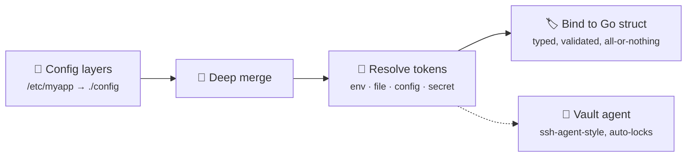

# FlexConf

**Flexible configuration & secret management for Go** — declare your config as
plain Go types, and let the people who *write* the config decide where each
value comes from: a file, an environment variable, or a vault. :sparkles:

```yaml
service: api
timeout: 10s
url: https://$(env:HOST)/api            # 🌱 from the environment
token: $(secret:artifactory/token)      # 🔐 from an encrypted vault
```

Your application code never changes — it just sees a `string`.

## :thinking: Why FlexConf?

Most config libraries make the **application** decide what is an env var, what
is a flag, and what is a secret — hardcoded at compile time. FlexConf flips
that around:

!!! tip "The core idea"

    The **application** declares *what* configuration it needs (typed Go
    structs). The **operator** decides *where* each value comes from — plain
    YAML, `$(env:…)`, `$(file:…)`, or `$(secret:…)` — without touching a line
    of Go.

That separation is what makes the same binary run unchanged on a laptop, in
CI, and in production — only the config files differ.

## :gear: How it works



1. **Layer** — config directories are merged lowest → highest precedence.
2. **Resolve** — `$(scheme:path)` tokens are expanded at load time.
3. **Bind** — the merged tree is bound to your struct; on any error, your
   struct is left untouched.

## :package: What's in the box

<div class="grid cards" markdown>

-   :material-layers-triple:{ .lg .middle } **Layered configuration**

    ---

    Stack config directories (`/etc/myapp`, `./config`, …). Maps deep-merge,
    scalars override — defaults live in Go.

-   :material-code-braces:{ .lg .middle } **Typed schema & binding**

    ---

    Plain Go structs with `flexconf` tags. Required fields, durations,
    nested types — binding is all-or-nothing.

-   :material-code-string:{ .lg .middle } **Templating tokens**

    ---

    `$(env:…)`, `$(file:…)`, `$(config:…)`, `$(secret:…)` — embeddable in
    literal text, with escaping and custom resolvers.

-   :material-safe-square:{ .lg .middle } **Vault-backed secrets**

    ---

    Secrets live in an encrypted vault (KeePass, …), never in config files.
    Operators own the vault registry.

-   :material-console:{ .lg .middle } **Secret agent & CLI**

    ---

    `flexconf secret unlock` spawns an ssh-agent-style daemon holding the
    unlocked vault in memory, auto-locking on idle.

-   :material-shape-plus:{ .lg .middle } **Variants & prompting**

    ---

    Polymorphic config via discriminators, and interactive prompting when a
    value can't be resolved silently.

</div>

## :rocket: Try it in 30 seconds

```console
$ go get github.com/sylvanld/go-flexconf
```

```go
type Config struct {
    Service string `flexconf:"service,required"`
    Token   string `flexconf:"token"` // may be $(secret:…) — the type doesn't care
}

var cfg Config
err := flexconf.New("/etc/myapp", "./config").Load("config.yaml", &cfg)
```

That's it — head to the **[Get started](quickstart.md)** guide for the full
four-step setup, including secrets. :point_left:
