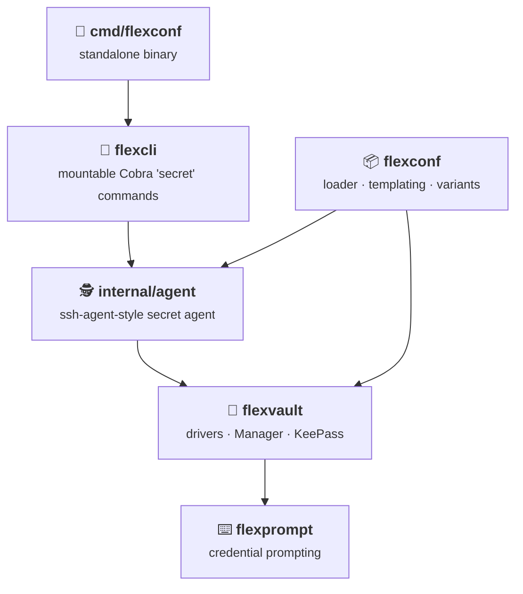

# User guide

The practical guide to the FlexConf SDK — one page per package or topic. This
page gives you the mental model: the vocabulary, the moving parts, and which
page to open next. The [specs](../specs/index.md) remain the normative source
of truth. :book:

!!! tip "Two hats, one config"

    Everything in FlexConf is built around a separation of roles: the
    **application developer** declares *what* configuration exists (typed Go
    structs), the **operator** decides *where* each value comes from (YAML +
    `$(…)` tokens). Most pages in this guide serve one hat more than the
    other — the [paths below](#pick-your-path) tell you which.

## :brain: Core concepts

Six words carry most of the meaning in these pages:

| Concept | In one sentence |
|---------|-----------------|
| **Loader** | The entry point: `flexconf.New(dirs…).Load(name, &cfg)` runs the whole pipeline — merge, resolve, bind. |
| **Layer** | One config directory in the stack; later layers win. Maps deep-merge, scalars and lists are replaced wholesale. |
| **Token** | A `$(scheme:path)` placeholder in a YAML value, expanded at load time by a **resolver** (`env:`, `file:`, `config:`, `secret:`, or your own). |
| **Schema** | Your Go struct with `flexconf` tags — typed, strict about unknown keys, all-or-nothing on error. |
| **Variant** | A config block whose concrete Go type is chosen by one of its own fields (a discriminator) — polymorphic config. |
| **Vault** | A named secret backend from the operator's registry; `$(secret:…)` tokens resolve against it, usually through a background **agent**. |

Each of these has a dedicated page — the tables below tell you which.

## :building_construction: Architecture at a glance

The SDK is three public packages plus an optional CLI layer, with
dependencies pointing strictly downward — so you only pull in what you use:

Worth knowing before you dive in:

- **`flexconf` is the front door** for config loading; most apps import it and
  little else.
- **`flexvault` stands alone** — an app that only needs secret management can
  depend on it (plus `flexprompt`) without the loader or Cobra.
- **The agent is internal.** Both the loader and the CLI talk to the same
  ssh-agent-style runtime; you never import it, you just call
  `flexconf.RunAgentIfRequested()` first thing in `main`.

## :compass: Pick your path

**:material-code-braces: I'm wiring FlexConf into my app** — read in order:

1. [Loading configuration](flexconf.md) — `New`/`Load`, layers, merge semantics,
   the load lifecycle, errors.
2. [Schema & binding](schema.md) — the `flexconf` tag, defaults, supported
   types, `Validate()`.
3. [Templating & resolvers](templating.md) — the token grammar, built-in
   schemes, escaping, custom resolvers.
4. [Variants & registry](variants.md) — when one YAML block can be one of
   several Go types.

**:material-safe-square: I'm setting up secrets** — read in order:

1. [Vault registry](vaults.md) — `vaults.yaml`, layering via
   `FLEXCONF_VAULTS`, the default vault.
2. [Secret resolution](secrets.md) — the `secret:` scheme, agent vs
   in-process policies, redaction.
3. [CLI & secret agent](cli.md) — the `secret` command group, the standalone
   binary, and the agent's lifecycle.

**:material-puzzle: I'm extending FlexConf** — go deeper:

- [Vault drivers](flexvault.md) — write your own backend: the `VaultDriver`
  interface, the `Manager` lifecycle, addressing.
- [Credential prompting](flexprompt.md) — control how credentials are
  collected: the `Prompter` singleton and built-ins.

!!! question "Just want it running?"

    This guide explains; it doesn't hand-hold. For the four-step end-to-end
    setup, use **[Get started](../index.md)** — then come back here when
    you want to know *why* it works.
